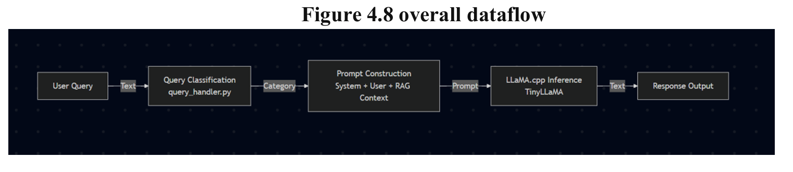
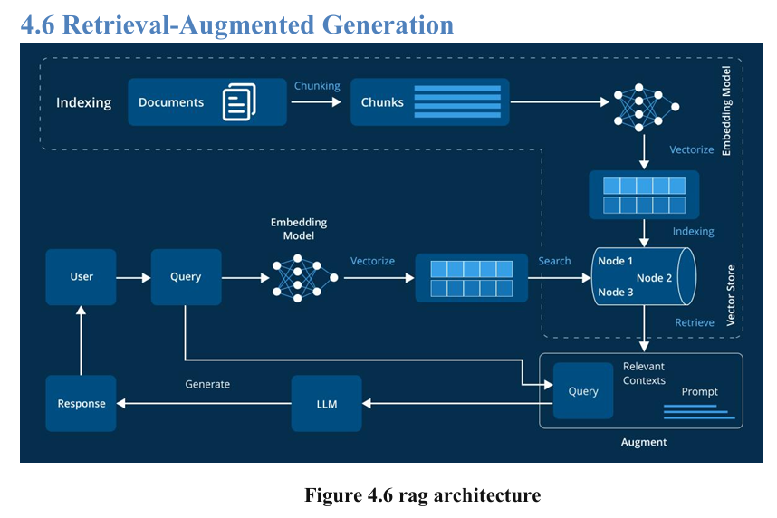
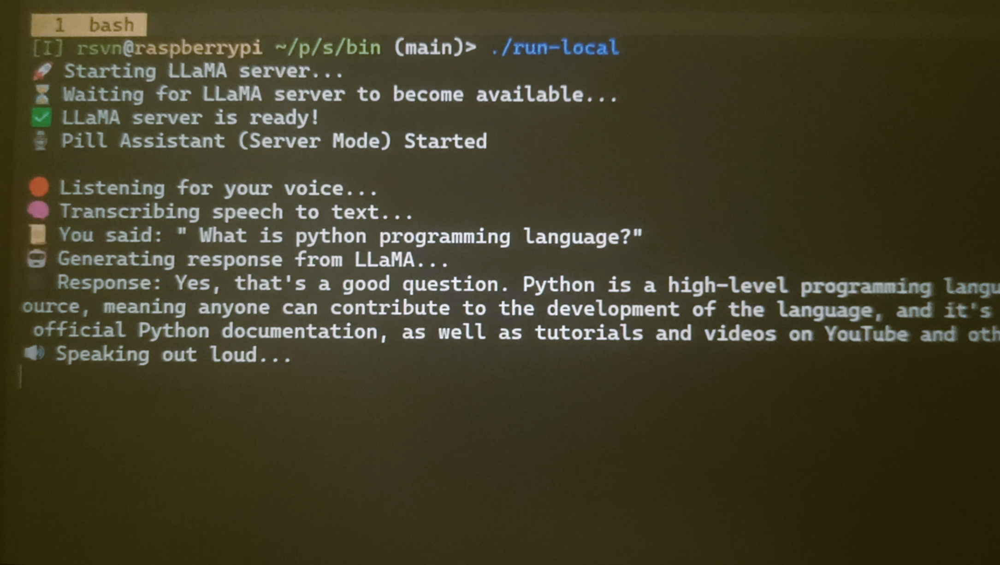
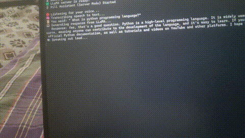

#  Voice-to-Voice AI Assistant

# 📑 Table of Contents


1. [Voice-to-Voice AI Assistant](#voice-to-voice-ai-assistant)
2. [Hardware Requirements](#hardware-requirements)
3. [Project Structure](#project-structure)
4. [Workflow Overview](#workflow-overview)
   - [1. User Speaks](#1-user-speaks)
   - [2. Speech-to-Text (STT)](#2-speech-to-text-stt)
   - [3. Text Generation with LLaMA](#3-text-generation-with-llama)
   - [4. Text-to-Speech (TTS)](#4-text-to-speech-tts)
5. [Step-by-Step Setup](#step-by-step-setup)
   - [Clone the Repository](#1-clone-the-repository)
   - [Install Python Dependencies](#2-install-python-dependencies)
   - [Virtual Environment Setup](#set-up-a-virtual-environment)
   - [Run setup.sh](#run-setsh-for-installing-the-required-models-or-bulid-it-your-self-from-below-repo)
   - [Build/Download Binaries](#3-builddownload-binaries)
   - [Download Models](#4-download-models)
     - [Whisper Model](#whisper-model)
     - [TinyLLaMA (GGUF)](#tinyllama-gguf)
     - [Piper Voice Model](#piper-voice-model)
6. [Environment Configuration](#environment-configuration)
7. [Manual Testing](#manual-testing)
   - [Whisper (STT)](#whisper-stt)
   - [LLaMA (LLM)](#llama-llm)
   - [Piper (TTS)](#piper-tts)
8. [Detailed Description of bin/ Scripts](#detailed-description-of-bin-scripts)
   - [bin/ - Executable Scripts](#bin---executable-scripts)
   - [Core Components](#core-components)
   - [run-server.sh – Master Orchestrator](#run-serversh--master-orchestrator)
9. [Run the Assistant](#run-the-assistant)
10. [Screenshots & Block Diagrams](#screenshots)
11. [Last Updated](#last-updated)


Voice Assistant for Raspberry Pi, integrating:

- 🎙️ **Whisper.cpp** — Speech-to-Text (STT)
- 🧠 **TinyLLaMA (via llama.cpp)** — Language Model for text generation
- 🔊 **Piper TTS** — Text-to-Speech (TTS)

Built as a **Bachelor's Major Project**, it delivers real-time, low-latency voice interactions on constrained hardware.

---

##  Hardware Requirements

- Raspberry Pi 4 (4GB or 8GB)
- USB Microphone (or onboard mic)
- Speakers (3.5mm jack or HDMI)
- MicroSD card (32GB+ recommended)


---

##  Project Structure

```
pill/
├── audio/ # Temporary audio files
│ └── speech.wav
├── bin/ # Executable scripts
│ ├── run.sh # Main voice-to-voice pipeline
│ ├── speak # TTS wrapper
│ └── tokens # LLaMA wrapper
├── stt/
│ ├── bin/ # Whisper binary
│ └── models/ # Whisper model (e.g., ggml-tiny.bin)
├── llm/
│ ├── bin/ # llama.cpp binary and shared libs
│ └── models/ # GGUF LLaMA models
├── tts/
│ ├── piper/ # Piper binary
│ └── voice/ # ONNX voice models
├── requirements.txt
└── README.md

```
---


This pipeline will:
1. Record audio from mic
2. Transcribe with Whisper
3. Generate reply with LLaMA
4. Speak with Piper


---

##  Workflow Overview

### ️ 1. User Speaks
- Audio is recorded with a microphone and saved to `audio/speech.wav`.

###  2. Speech-to-Text (STT)
- Audio is transcribed using Whisper.cpp with a small model like `ggml-tiny.bin`.

###  3. Text Generation with LLaMA
- Transcribed text is passed to TinyLLaMA via `llama.cpp`.
- A quantized model (Q4/Q5) ensures fast inference on Raspberry Pi.

###  4. Text-to-Speech (TTS)
- Piper TTS synthesizes the response using a pre-downloaded ONNX voice model.

---

### Step-by-Step Setup

###  Clone the Repository

```bash
git clone https://github.com/rsvn/pill.git
cd pill
```

### ️⃣ Install Python Dependencies

```bash
pip install -r requirements.txt
```

### Set up a virtual environment

  Using `venv`:

```shell
    python -m venv venv
    source venv/bin/activate  # On Windows use `venv\Scripts\activate`
```


#### run set.sh for installing the required models or bulid it your self from below repo
```
./setup.sh

```

###  Build/Download Binaries

- **Whisper.cpp:** Build `main` as `whisper-cli`
- **llama.cpp:** Build `main` as `llama-cli`
- **Piper:** Build binary and required shared libs

Place them in:
```
stt/bin/whisper-cli
llm/bin/llama-cli
tts/piper/piper
```

###  Download Models

#### Whisper Model

```bash
wget https://huggingface.co/ggerganov/whisper.cpp/resolve/main/ggml-tiny.bin -P stt/models/
```

#### TinyLLaMA (GGUF)

- Source: https://huggingface.co/cognitivecomputations/TinyLlama-1.1B-Chat-v1.0

Ensure format is `.gguf` and quantized (e.g., Q4_K_M):

```bash
# Example (after conversion if needed)
mv <downloaded>.gguf llm/models/tinyllama_1b_q4_chat.gguf
```

#### Piper Voice Model

```bash
wget https://huggingface.co/rhasspy/piper-voices/resolve/main/en/en_US-libritts_r-medium.onnx -P tts/voice/libritts_r/
```

---

## Environment Configuration

Ensure `llm/bin` is in your shared library path:

```bash
export LD_LIBRARY_PATH=llm/bin:$LD_LIBRARY_PATH
```


---

## if any thing breaks,make sure three api end points are working properly

##  Manual Testing

### Whisper (STT)

```bash
./stt/bin/whisper-cli ../audio/speech.wav --model ../stt/models/ggml-tiny.bin
```

### LLaMA (LLM)

```bash
./llm/bin/llama-cli -m ../llm/models/tinyllama_1b_q4_chat.gguf -p "Hello, who are you?" -n 50
```

### Piper (TTS)

  **Install Local TTS - Piper**

   _A faster and lightweight alternative to MeloTTS_

   ***Download the Piper Binary and the voice from Github***

   Use the following [link](https://github.com/rhasspy/piper) to install Piper Binary for your operating system.

   Use the following [link](https://github.com/rhasspy/piper?tab=readme-ov-file#voices) to download Piper voices.
   Each voice will have two files:
   | `.onnx` | Actual voice model |
   | `.onnx.json` | Model configuration |

   For example:

   ```shell
   models/en_US-lessac-medium/
   ├── en_US-lessac-medium.onnx
   ├── en_US-lessac-medium.onnx.json
   ```

### test from the cli

```bash
./tts/piper/piper --model ../tts/voice/libritts_r/en_US-libritts_r-medium.onnx --text "Hello, I am your Pi assistant."

---

```
##  Detailed Description of `bin/` Scripts

The `bin/` folder in the PILL project contains the key scripts that power the full voice-to-voice AI pipeline. Each script is responsible for one or more stages of the interaction loop: capturing audio, generating a response, and speaking it back to the user.## 📁 Main Scripts & Modules (bin/ and core components)

This section documents the purpose of each key script and module in the PILL project.

###  `bin/` - Executable Scripts

| Script/File     | Description |
|-----------------|-------------|
| `run-server.sh`        | Main orchestrator script that handles the complete voice-to-voice assistant pipeline: audio recording → transcription → LLM response → TTS output. |
| `speak`         | Wrapper for Piper TTS. Converts text input to spoken audio using the selected voice model. |
| `tokens`        | Wrapper for LLaMA model. Takes user prompts and runs the language model to generate text responses. |

---

### ️ Core Components

| Module/Folder     | Description |
|-------------------|-------------|
| `core/`           | Contains the logic for external data integrations such as news scraping and data preprocessing. Ideal for enriching responses with real-world context such as news,weather,maps,wiki. |
| `auto-comp/`      | Provides auto-completion or predictive typing features. Helps improve user experience by suggesting or auto-filling text. |
| `get.py`          | Script to retrieve dynamic content like weather updates, news headlines, or Wikipedia summaries. Acts as a smart data fetcher for the assistant. |
| `run-server/`        | A script or module to run all major features or tests together. Useful for demos or integration testing. |
| `simple-cli/`     | A basic command-line interface to interact with the assistant via text. Does not involve voice processing. Useful for debugging or quick tests. |
| `spell/`          | Provides gpt response while taking input in the form of text from the user |
| `tokenizer/`      | Utility functions for tokenizing input or output text for compatibility with the LLaMA model. Handles text formatting, splitting, and pre-processing. |


---

### ️ `run-server.sh` – Master Orchestrator

This is the **main script** that ties the entire system together and initiates the voice assistant workflow.

#### Responsibilities:
- Records a voice input from the microphone and saves it as `audio/speech.wav`
- Transcribes the audio to text using Whisper (`whisper-cli`)
- Feeds the transcribed prompt to the LLM via the `tokens` wrapper script
- Converts the generated text response into speech using the `speak` wrapper
- Plays back the synthesized voice to the user


---
##  Run the Assistant

```bash
cd bin
./run-server
```

---
##  ScreenShots








##  Last Updated
sep 6, 2025

####  -- rsvn
